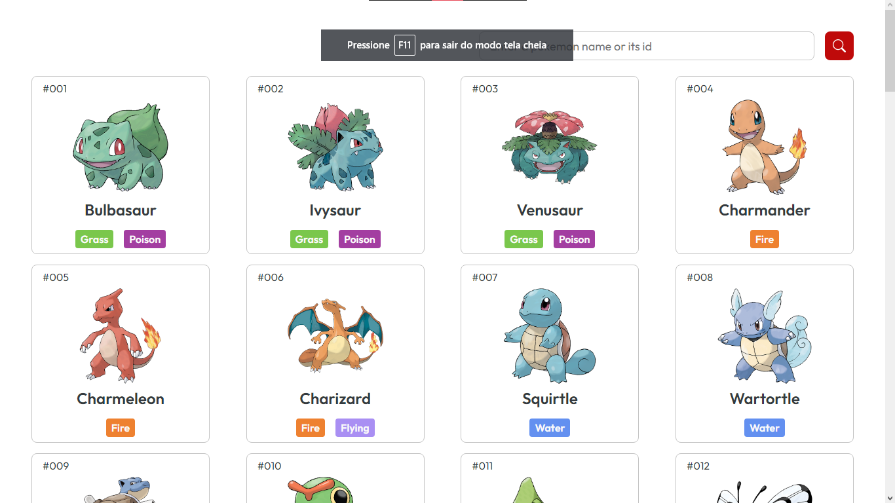
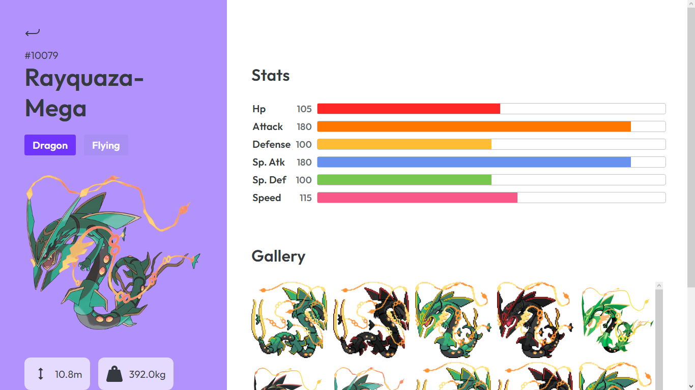

<h1 align="center">
  <br>
  
  <br>
  Pokedéx
  <br>
</h1>

<h4 align="center">A pokedéx created for the <a href="https://www.looqbox.com" target="_blank" style="color: #40DA61">looqbox</a> frontend challenge using the <a href="http://https://pokeapi.co" target="_blank">PokéAPI</a>.</h4>

<p align="center">
  
  
  <a href="https://github.com/danzobiss/pokedex/commits/master">
    
  </a>
   <a href="https://github.com/danzobiss/pokedex/stargazers">
    
  </a>
</p>

<p align="center">
  <a href="#-key-features">Key Features</a> •
  <a href="#-how-to-use">How To Use</a> •
  <a href="#-pages">Pages</a> •
  <a href="#-demo">Demo</a>
</p>


## 🔑 Key Features

* List of pokémons page
  - Displays 20 pokémons and their basic information
  - Loads 20 more pokémons when you click "Show More Pokémons"
  - Search for a pokémon by name or id
* Details page
  - Displays more specific information about a pokémon
  - Bars about pokémon stats
  - Gallery of other pokémon pictures
* Save the list of pokémons already loaded in memory

## ⚙ How To Use

To clone and run this application, you'll need [Git](https://git-scm.com) and [Node.js](https://nodejs.org/en/download/) (which comes with [npm](http://npmjs.com)) installed on your computer. From your command line:

```bash
# Clone this repository
$ git clone https://github.com/danzobiss/pokedex.git

# Go into the repository
$ cd looqbox-frontend-challenge

# Install dependencies
$ npm install

# Run the app
$ npm start
```

> **Note**
> If you're using Linux Bash for Windows, [see this guide](https://www.howtogeek.com/261575/how-to-run-graphical-linux-desktop-applications-from-windows-10s-bash-shell/) or use `node` from the command prompt.


## 🖼 Pages

### Home


### Details


## 🤖 Demo
> <a href="https://danzobiss-pokedex.netlify.app">https://danzobiss-pokedex.netlify.app</a>
